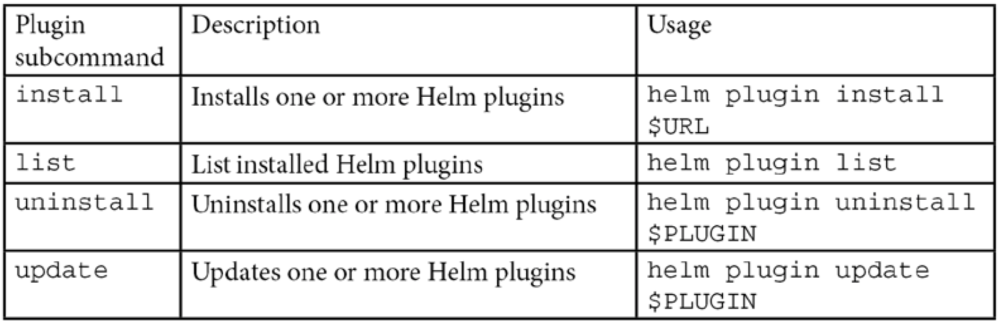
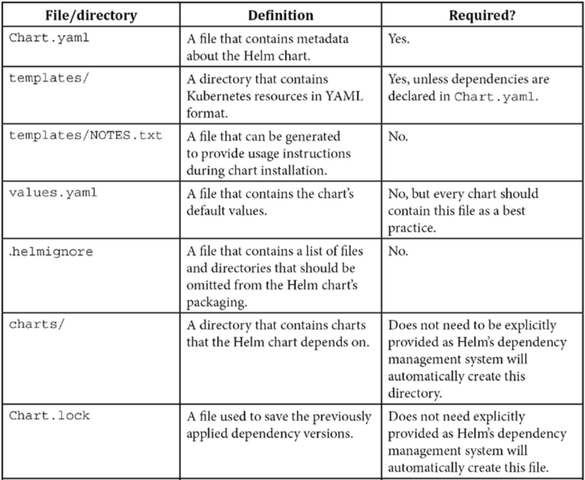
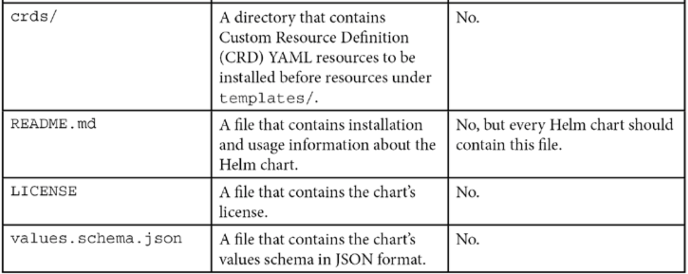
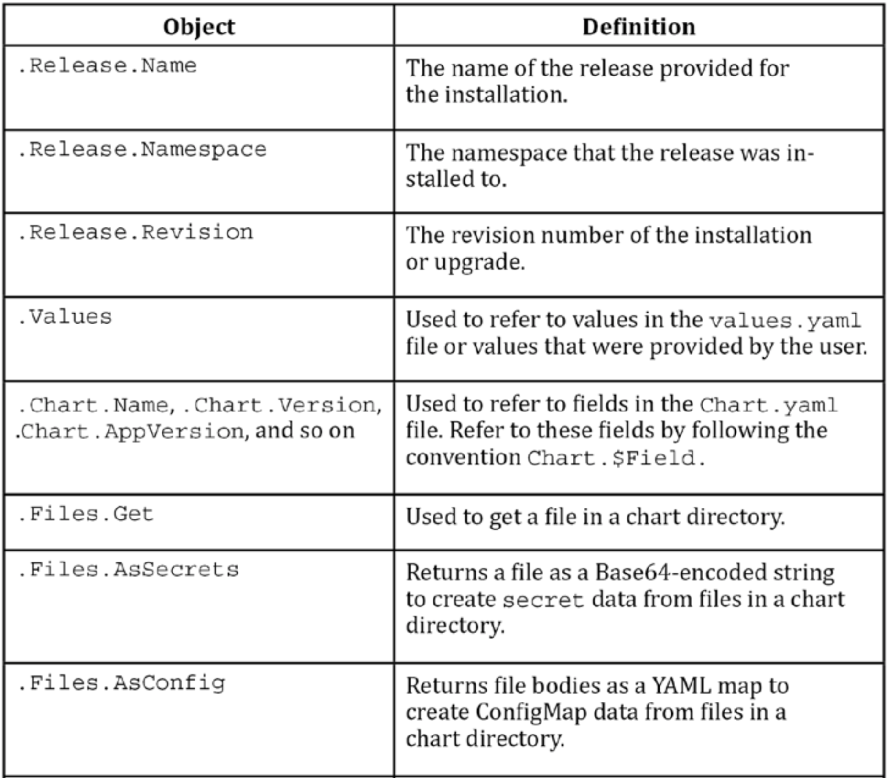
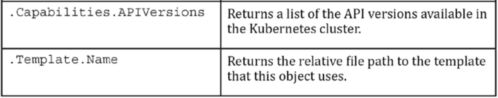
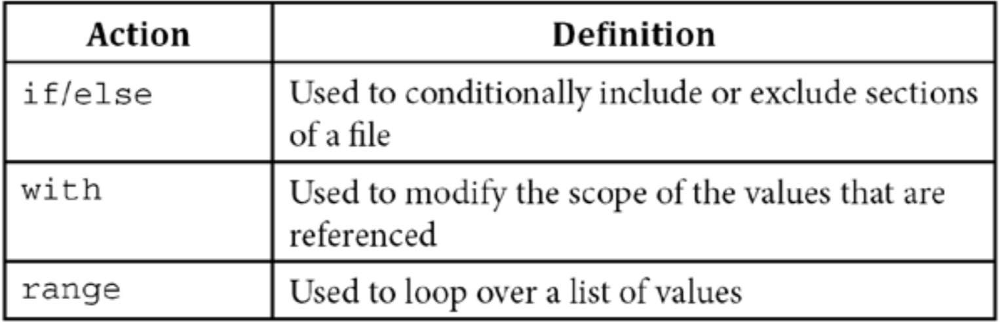
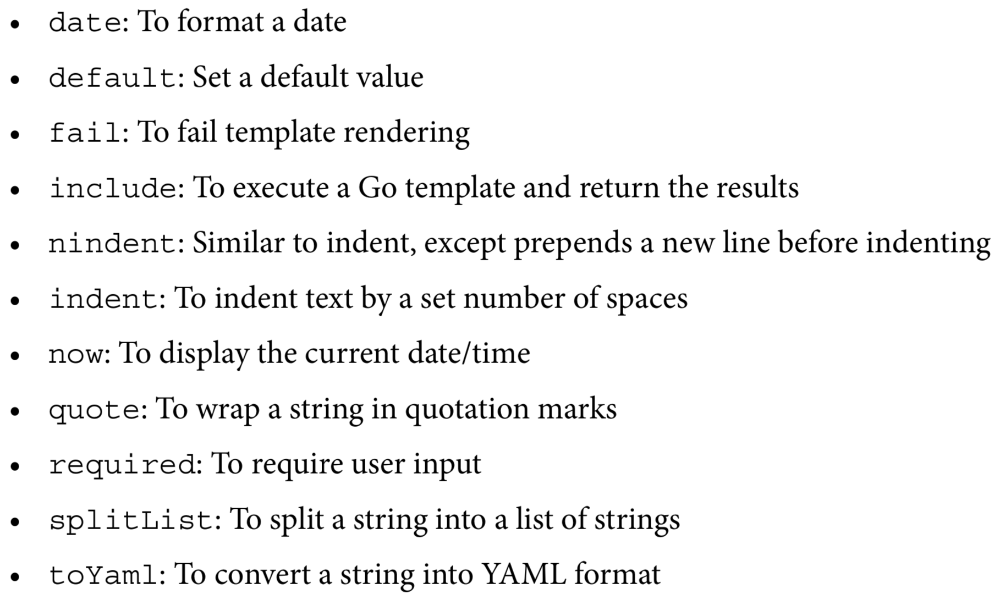
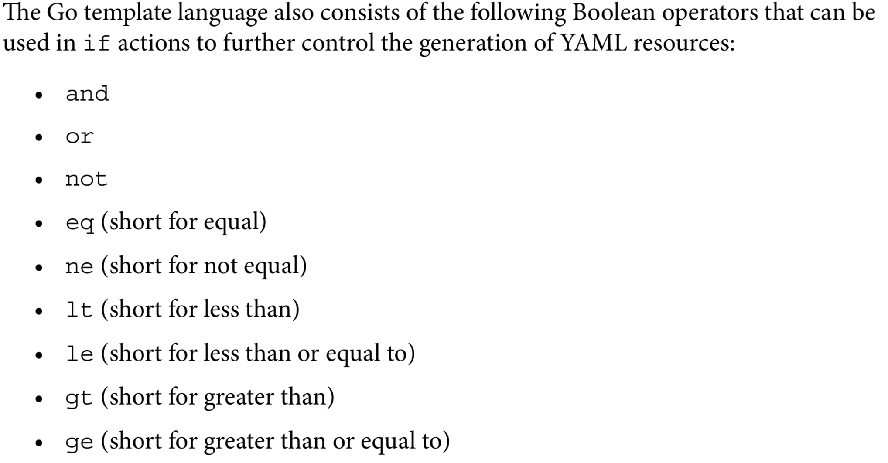

``` 
 _   _      _           
| | | | ___| |_ __ ___  
| |_| |/ _ \ | '_ ` _ \ 
|  _  |  __/ | | | | | |
|_| |_|\___|_|_| |_| |_|
                        
```

## The Kubernetes package manager
- Helm, on the other hand, works with charts. A Helm chart can be thought of as a Kubernetes package. Charts contain the declarative Kubernetes resource files required to deploy an application. Similar to an RPM, it can also declare one or more dependencies that the application needs in order to run.
- Chart developers create declarative YAML files, package them into charts, and publish them to chart repositories. End users then use Helm to search for existing charts to deploy onto Kubernetes, similar to how end users of dnf will search for RPM packages to deploy to Fedora.
- Helm could be used to deploy Redis, an in-memory cache, to Kubernetes by using a chart published to an upstream repository. This could be performed using Helm's install command:
  - ```helm install redis bitnami/redis --namespace=redis```
    - This would install the redis chart from the bitnami chart repository to a Kubernetes namespace called redis. This installation would be referred to as the initial revision, or the initial deployment of a Helm chart.
  - ```helm upgrade redis bitnami/redis --namespace=redis```
    - If a new version of the redis chart becomes available, users can upgrade to a new version using the upgrade command.
  - ```helm rollback redis 1 --namespace=redis```
    - With operating systems, users should be concerned about rollbacks if a bug or vulnerability is found.
    - This command would roll Redis back to its first revision.
  - ```helm uninstall redis --namespace=redis```
    - Helm provides the ability to remove Redis altogether with the uninstall command.
    
## Adding upstream repositories
- Helm provides the **repo** sub-command to allow users to manage configured chart repositories. This sub command contains additional subcommands that can be used to perform actions against specified repositories.
- Here are the five **repo** sub commands:
  - **add**: To add a chart repository
    - ```helm repo add $REPO_NAME $REPO_URL```
  - **list**: To list chart repositories
    - You can confirm whether a repository has been successfully added by leveraging the **repo list** sub command:
    - ```helm repo list```
  - **remove**: To remove a chart repository
    - This can be accomplished by using the **repo remove** subcommand:
    - ```helm repo remove bitnami```
  - **update**: To update information on available charts locally from chart repositories
    - You can instruct Helm to check for updates from each added repository by running the repo update sub command. 
    - Once this command is executed, you will be able to install the latest charts from each repository:
    - ```helm repo update```
  - **index**: To generate an index file given a directory containing packaged charts
    - This sub command is used by repository and chart maintainers to publish new or updated charts.

## Adding plugins
- Plugins are add-on capabilities that can be used to provide additional features to Helm.
- A list of these plugins can be found at *https://helm.sh/docs/community/related/*.
- Helm provides a **plugin** subcommand for managing plugins



- The following are several examples of the upstream plugins:
  - **helm diff**: Performs a diff between a deployed release and a proposed Helm upgrade
  - **helm secrets**: Used to help conceal secrets from Helm charts
  - **helm monitor**: Used to monitor a release and perform a rollback if certain events occur
  - **helm unittest**: Used to perform unit testing on a Helm chart
  
## Environment variables
- The Helm documentation lists six primary environment variables used to configure Helm:
  - **XDG_CACHE_HOME**: Sets an alternative location for storing cached files
  - **XDG_CONFIG_HOME**: Sets an alternative location for storing Helm configuration
  - **XDG_DATA_HOME**: Sets an alternative location for storing Helm data
  - **HELM_DRIVER**: Sets the backend storage driver
  - **HELM_NO_PLUGINS**: Disables plugins
  - **KUBECONFIG**: Sets an alternative Kubernetes configuration file
- Helm adheres to The **XDG Base Directory** Specification.

## Tab completion
- Tab completion allows Helm commands to be auto-completed when the Tab key is pressed, allowing users to perform tasks faster and helping prevent input mistakes.
  - ```source <(helm completion $SHELL)```
  - $SHELL variable must be either bash or zsh.

## Authentication
- A kubeconfig file can be created by leveraging three different kubectl commands:
  - The first command is set-cluster:
    - ```kubectl config set-cluster```
  - The next command is set-credentials:
    - ```kubectl config set-credentials```
  - Then, we have the set-context command:
    - ```kubectl config set-context```
    
## Installing your First Helm Chart
- Finding a WordPress chart
  - Helm Hub is a centralized location for upstream chart repositories.
  - Powered by a community project called Monocular, Helm Hub is designed to aggregate all known public chart repositories and provide a search functionality.
  - To search for charts in Helm Hub or an instance of Monocular, use the following command:
    - ```helm search hub```
  - To search repositories for a keyword in Charts, use the following command
    - ```helm search repo```
  - Execute the following command to locate charts containing the wordpress keyword:
    - ```helm search hub wordpress```
  - Try running the following command by including the **--max-col-width** flag to view the untruncated results in table format:
    - ```helm search hub wordpress  --max-col-width=0```
  - Try running the previous command again with the **--output** yaml flag:
    - ```helm search hub wordpress -o yaml```
    - ```helm repo add bitnami https://charts.bitnami.com/bitnami```
  - Verify that the chart has been added by running helm repo list:
    - ```helm repo list```
  - Run the following command to view charts from locally configured repositories that contain the bitnami keyword:
    - ```helm search repo bitnami -o yaml```
  - To ensure that you now have access to the WordPress chart, run the following helm search repo command with the wordpress argument:
    - ```helm search repo wordpress```
  - Previous versions can be observed by passing the **--versions** flag to the search command:
    - ```helm search repo wordpress --versions```
  - This command shows the chart's metadata (or chart definition):
    - ```helm show chart bitnami/wordpress```
  - This command shows the chart's README file:
    - ```helm show readme bitnami/wordpress```
  - This command shows the chart's values:
    - ```helm show values bitnami/wordpress```
  - This command shows the chart's definition, README files, and values:
    - ```helm show all bitnami/wordpress```
  - Run the helm show chart command to retrieve the metadata for the chart:
    - ```helm show chart bitnami/wordpress --version 10.6.4```
  - Run the helm show readme command to view the chart's README file from the command line:
    - ```helm show readme bitnami/wordpress --version 10.6.4```
  - Run the following command to inspect the WordPress chart's values:
    - ```helm show values bitnami/wordpress --version 10.6.4```
  - Create a new file on your machine called wordpress- values.yaml. In that file, enter the following content:
    - ```
         wordpressUsername: helm-user
         wordpressPassword: my-pass
         wordpressEmail: helm-user@example.com
         wordpressFirstName: Helm_is
         wordpressLastName: Fun
         wordpressBlogName: Learn Helm!
         service:
            type: NodePort
      ```
  - Install a new release called **wordpress** using the **bitnami/wordpress** Helm chart
    - ```helm install wordpress bitnami/wordpress -f wordpress-values.yml  -n wordpress```
  - Run the following command to view the list of releases in the **wordpress** namespace:
    - ```helm ls -n wordpress```
  - To get all the hooks for a named release, run the following command:
    - ```helm get hooks wordpress -n wordpress```
  - To get the manifest for a named release, run the following command:
    - ```helm get manifest wordpress -n wordpress```
  - To get the notes for a named release, run the following command:
    - ```helm get notes wordpress -n wordpress``` 
  - To get the values for a named release, run the following command:
    - ```helm get values wordpress -n wordpress``` 
  - To get all the information about a named release, run the following command:
    - ```helm get all wordpress -n wordpress```
  - You can set the variable on macOS and Linux as follows:
    - ```export HELM_NAMESPACE=wordpress```
  - This variable's value can be verified by running the helm env command:
    - ```helm env```
  - Accessing the WordPress application. Run the four commands listed here:
    - ```export NODE_PORT=$(kubectl get -n wordpress -o jsonpath="{.spec.ports[0].nodePort}" services wordpress)```
    - ```export NODE_IP=$(kubectl get nodes -n wordpress -o jsonpath="{.items[0].status.addresses[0].address}")```
    - ```echo "WordPress URL: http://$NODE_IP:$NODE_PORT/"```
    - ```echo "WordPress Admin URL: http://$NODE_IP:$NODE_PORT/admin"```
    - ```echo Password: $(kubectl get secret -n wordpress wordpress -o jsonpath='{.data.wordpress-password}' | base64 --decode)```
  - Add the following line to your wordpress-values.yaml file to increase the number of replicas from 1 to 2:
    - ```replicaCount: 2```
  - Run the following command to upgrade the WordPress release with a new set of values:
    - ```helm upgrade wordpress bitnami/wordpress -f wordpress-values.yaml -n wordpress```
  - Rolling back the WordPress release. Run the following command to execute the rollback of WordPress to revision 3:
    - ```helm rollback wordpress 3 -n wordpress```
  - The release's revision history, which can be viewed by running the helm history command:
    - ```helm history wordpress -n wordpress```
  - Let's determine the release that had the full set of desired values.
    - ```helm get values wordpress --revision 3 -n wordpress```
  - This rollback can be observed in the release history by running the helm history command:
    - ```helm history wordpress -n wordpress```
  - Uninstall the WordPress release by running the helm uninstall command:
    - ```helm uninstall wordpress -n wordpress```
    - You will, however, notice that there is still a PersistentVolumeClaim command available in the namespace:
      - ```kubectl get pvc -n chapter3```
      - ```This PersistentVolumeClaim resources was not deleted because it was created in the background by a StatefulSet. In Kubernetes, the PersistentVolumeClaim resources that are created by a StatefulSet are not automatically removed if the StatefulSet is deleted.```
  
  
## The Helm chart structure
- In order to be considered a Helm chart, however, a certain file structure must be followed:
- For the preceding example file structure, the Helm chart's name is likely to be **my-chart**.
  
  
  
- Helm charts must contain a **templates/** directory that defines the Kubernetes resources.
  
  ```
  templates/
    configmap.yaml
    deployment.yaml
    service.yaml
  ```
  
- The **configmap.yaml** resource may then look as follows
  
  ```
  apiVersion: v1
  kind: ConfigMap
  metadata:
    name: {{ .Release.Name }}
  data:
    configuration.txt: |-
      {{ .Values.configurationData }}
  ```
- The opening and closing curly braces represent input text for a **Golang (Go)** template that will be removed during an installation or upgrade.
  
- Helm charts contain a **values.yaml** file in their chart directories. 
- This file declares all of a chart's default values, which are referenced by Go templates and processed by Helm to dynamically generate Kubernetes resources.
  
  ```
  ## chapterNumber lists the current chapter number
  chapterNumber: 4
  ## chapterName gives a description of the current chapter
  chapterName: Understanding Helm Charts
  ```
  
- Go templates beginning with **.Values** will reference values defined in a **values.yaml** file or passed in using the **--set** or **--values** flags during an installation or upgrade.




- the .Values scope only makes a chart's values visible; 
- the .Release scope only makes fields under the Release object visible; 
- the . scope represents global scope, making all of these objects visible

- Go templating also provides developers with the ability to control the flow and structure of their templates.



```
readinessProbe:
{{- if .Values.probeType.httpGet }}
  httpGet:
    path: /healthz
    port: 8080
    scheme: HTTP
{{- else }}
    tcpSocket:
      port: 8080
{{- end }}
    initialDelaySeconds: 30
    periodSeconds: 10
```

- The following code describes a **values** file, which includes deeply nested values:
```
application:
  resources:
    limits:
      cpu: 100m
      memory: 512Mi
```

- Without the **with** action, these values would be referenced in a **template** file, as follows:
```
cpu: {{ .Values.application.resources.limits.cpu }}
memory: {{ .Values.application.resources.limits.memory }}
```

- The **with** action allows a developer to modify the scope of these values and reference them with a shortened syntax:
```
{{- with .Values.application.resources.limits }}
cpu: {{ .cpu }}
memory: {{ .memory }}
{{- end }}
```

- Finally, developers can perform repetitive actions using the **range** action.
- Imagine that a chart has the following values:

```
servicePorts:
 - name: http
   port: 8080
 - name: https
   port: 8443
 - name: jolokia
   port: 8778
```

- The preceding code provides a list of **servicePorts**, which can be looped over, shown in the following example:

```
spec:
  ports:
{{- range .Values.servicePorts }}
  - name: {{ - name }}
  port: {{ .port }}
{{- end }}
```

- A variable in a chart template is defined as follows:

```
{{ $myvar := 'Hello World!' }}
```

- Variables can be assigned to objects as well, such as a chart's values:

```
{{ $myvar := .Values.greeting }}
```

- A variable that is set is then referenced later in the template in the following way:

```
data:
  greeting.txt: |
    {{ $myvar }}
```

- variables are set to capture the index and value of list iterations:

```
data:
  greetings.txt: |
{{- range $index, $value := .Values.greetings }}
  Greeting {{ $index }}: {{ $value }}
{{- end }}
```

- Go pipelines work in a similar way. This can again be demonstrated with the indent function. This will also indent the config value by 4 spaces.
```
data:
  application-config: |-
{{ .Values.config | indent 4 }}
```

- A third command can be added to the pipeline, called **quote**, which quotation quote marks around the final templated product:
```
data:
  application-config: |-
{{ .Values.config | indent 4 | quote }}
```

- Some common Go template functions that you may use during chart development are as follows:





## Library charts
- Helm charts have a **type** field defined in the **Chart.yaml** file that is set to either **application** or **library**.